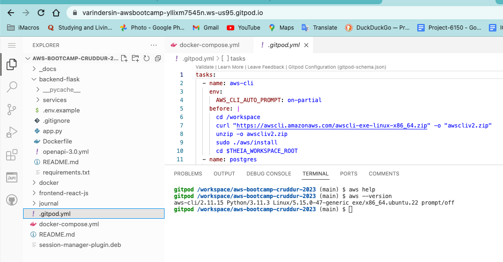
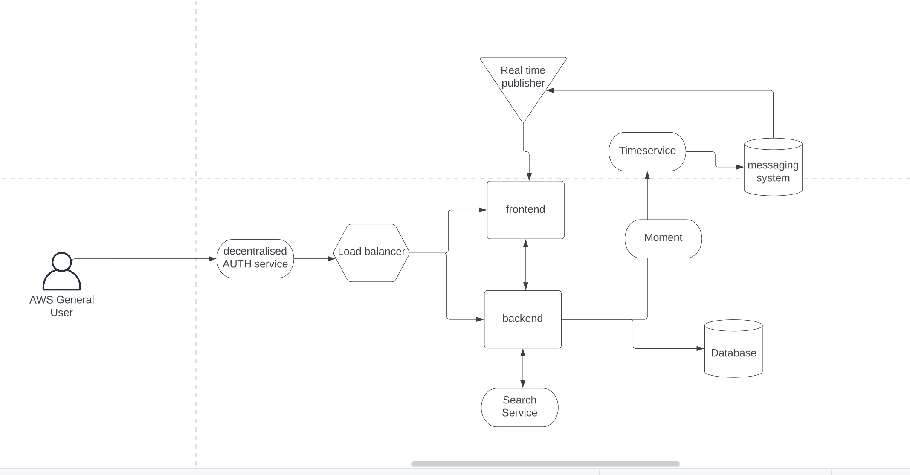
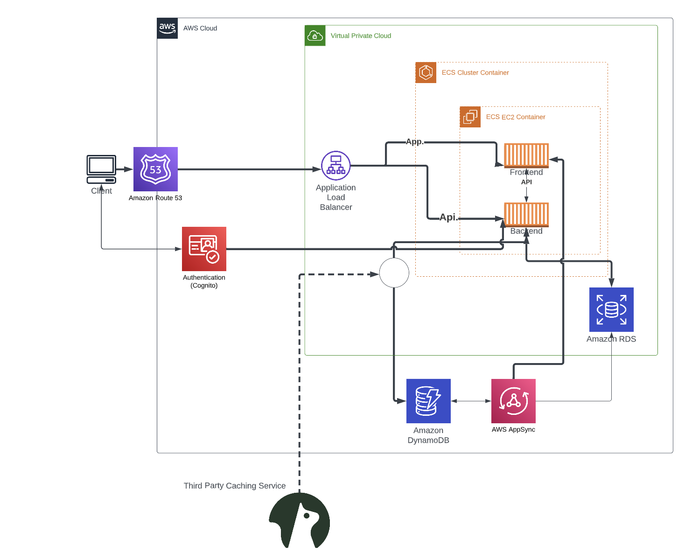
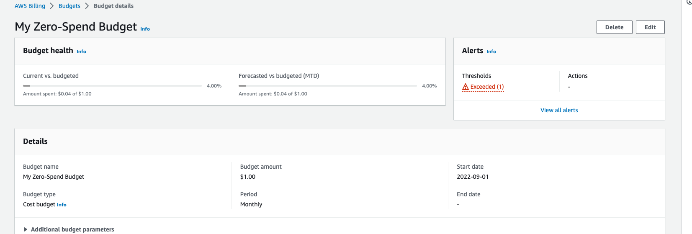

# Week 0 — Billing and Architecture

## Required Homework

## Installing AWS CLI
Used Gitpod to install the AWS CLI by running this commands
```
 cd /workspace
      curl "https://awscli.amazonaws.com/awscli-exe-linux-x86_64.zip" -o "awscliv2.zip"
      unzip awscliv2.zip
      sudo ./aws/install
      cd $THEIA_WORKSPACE_ROOT
 ```
 ### Here is the proof of it:
 

### Napkin Diagram 


[Link for the Napkin Diagram](https://lucid.app/lucidchart/85c40509-c53f-43ed-b5c4-11dcc53f1524/edit?viewport_loc=-436%2C-351%2C2099%2C986%2C0_0&invitationId=inv_3e5905e3-86f6-4031-854b-f37190f03b71)

### Logical Diagram


### Budget


Second Budget with CLI: 

