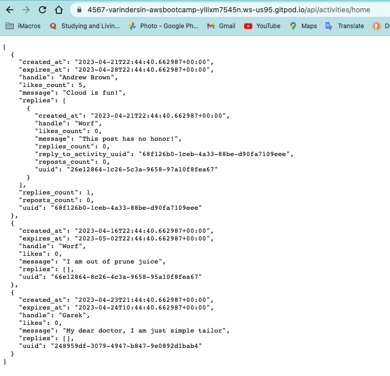
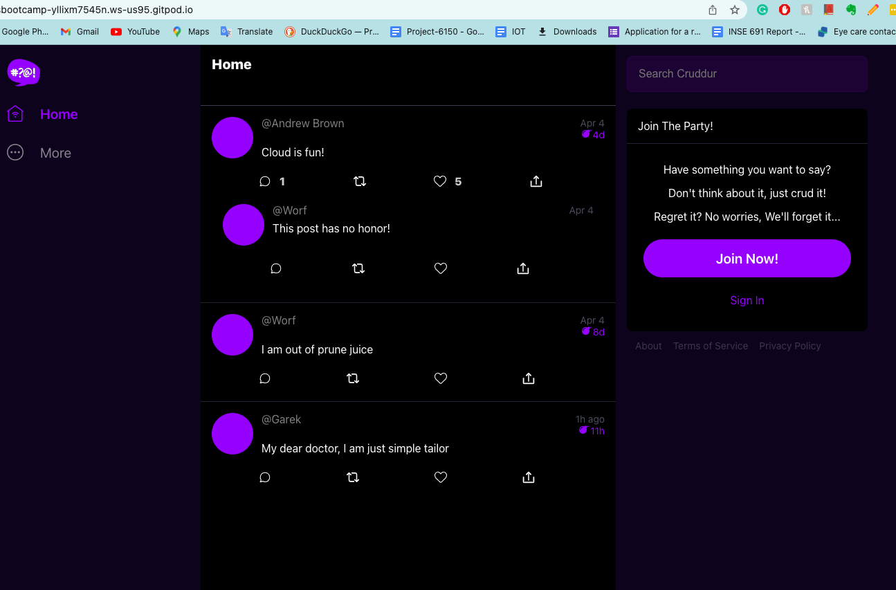
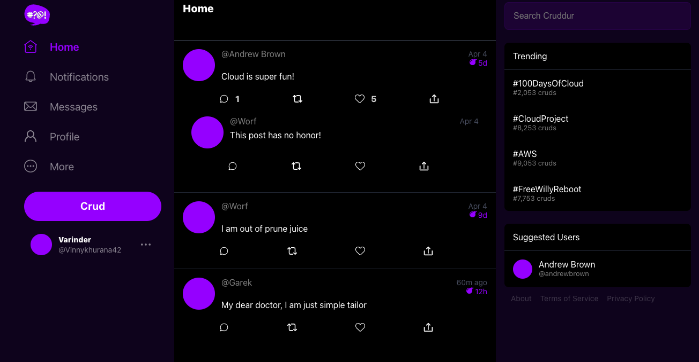
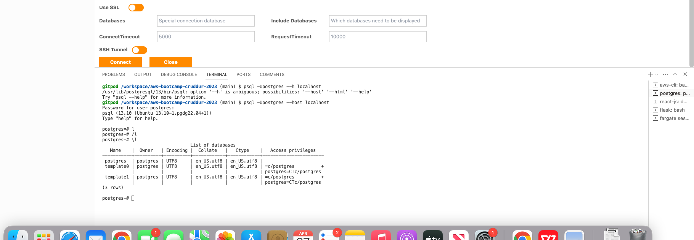

# Week 1 — App Containerization
## Homework Week1
### Creating a docker backend
To create the docker configuration for the backend-flask, create a file called Dockerfile and copy the following code
```
FROM python:3.10-slim-buster

WORKDIR /backend-flask

COPY requirements.txt requirements.txt
RUN pip3 install -r requirements.txt

COPY . .

ENV FLASK_ENV=development

EXPOSE ${PORT}
CMD [ "python3", "-m" , "flask", "run", "--host=0.0.0.0", "--port=4567"]
```
from the project directory type the following code to build the image
```
docker build -t backend-flask ./backend-flask
```
typing this command to run the image of the container
```
docker run --rm -p 4567:4567 -it backend-flask
```
this code create the 2 var env and run the container
```
docker run --rm -p 4567:4567 -it -e FRONTEND_URL='*' -e BACKEND_URL='*' backend-flask
```
### Backend running

### Creating docker frontend
move to the frontend folder and install npm this command will be execute every time you launch the gitpod session
```
cd frontend-react-js
npm i
```
To create the docker configuration for the frontend-react-js, create a file called Dockerfile and copy the following code
```
FROM node:16.18

ENV PORT=3000

COPY . /frontend-react-js
WORKDIR /frontend-react-js
RUN npm install
EXPOSE ${PORT}
CMD ["npm", "start"]
```
### Create docker compose
```
version: "3.8"
services:
  backend-flask:
    environment:
      FRONTEND_URL: "https://3000-${GITPOD_WORKSPACE_ID}.${GITPOD_WORKSPACE_CLUSTER_HOST}"
      BACKEND_URL: "https://4567-${GITPOD_WORKSPACE_ID}.${GITPOD_WORKSPACE_CLUSTER_HOST}"
    build: ./backend-flask
    ports:
      - "4567:4567"
    volumes:
      - ./backend-flask:/backend-flask
  frontend-react-js:
    environment:
      REACT_APP_BACKEND_URL: "https://4567-${GITPOD_WORKSPACE_ID}.${GITPOD_WORKSPACE_CLUSTER_HOST}"
    build: ./frontend-react-js
    ports:
      - "3000:3000"
    volumes:
      - ./frontend-react-js:/frontend-react-js

# the name flag is a hack to change the default prepend folder
# name when outputting the image names
networks: 
  internal-network:
    driver: bridge
    name: cruddur
 ```
 To run the docker compose, type **docker compose up** command in CLI
  add this code on the docker compose yml to prepare the image for dyanodb and postgres
  ```
   dynamodb-local:
    # https://stackoverflow.com/questions/67533058/persist-local-dynamodb-data-in-volumes-lack-permission-unable-to-open-databa
    # We needed to add user:root to get this working.
    user: root
    command: "-jar DynamoDBLocal.jar -sharedDb -dbPath ./data"
    image: "amazon/dynamodb-local:latest"
    container_name: dynamodb-local
    ports:
      - "8000:8000"
    volumes:
      - "./docker/dynamodb:/home/dynamodblocal/data"
    working_dir: /home/dynamodblocal
  db:
    image: postgres:13-alpine
    restart: always
    environment:
      - POSTGRES_USER=postgres
      - POSTGRES_PASSWORD=password
    ports:
      - '5432:5432'
    volumes: 
      - db:/var/lib/postgresql/data
  ```
  on docker compose file, add this code after networks
  ```
  volumes:
  db:
    driver: local
  ```
  to check the if postgres, check the command in the section troubleshooting. to check the if dyanodb works, check the command in the section troubleshooting.
  ### FrontEnd Running
  
 
 
  
  ### Troubleshooting commands
  This command check the images on the local machine
  ```
  docker images
  ```
  this command check the status of the container. good to see if it is not running
  ```
  docker ps
  ```
  from docker extention, click the container image and go to attach shell this open the shell on the contianer. use this tool for troubleshooting

  I got problem commiting as I did some changes on github and the same time on gitpod. to solve
  ```
  git pull --rebase
  git push
  ```
  To test postgres, enter to postgres on container type the following command
  ```
  psql -Upostgres --host localhost
  ```
  to test dynabodb locally you can check using the following command
  ### Create a local table
  ```
  aws dynamodb create-table \
    --endpoint-url http://localhost:8000 \
    --table-name Music \
    --attribute-definitions \
        AttributeName=Artist,AttributeType=S \
        AttributeName=SongTitle,AttributeType=S \
    --key-schema AttributeName=Artist,KeyType=HASH AttributeName=SongTitle,KeyType=RANGE \
    --provisioned-throughput ReadCapacityUnits=1,WriteCapacityUnits=1 \
    --table-class STANDARD
   ```
   ### Create an Item
   ```
        --endpoint-url http://localhost:8000 \
    --table-name Music \
    --item \
        '{"Artist": {"S": "No One You Know"}, "SongTitle": {"S": "Call Me Today"}, "AlbumTitle": {"S": "Somewhat Famous"}}' \
    --return-consumed-capacity TOTAL  
   ```
   ### List Tables
   ```
   aws dynamodb list-tables --endpoint-url http://localhost:8000
   ```
   ### Get Records
   ```
  aws dynamodb scan --table-name Music --query "Items" --endpoint-url http://localhost:8000
   ```
   
   ### Postgres Running
   
  
 

  
  
  
  


